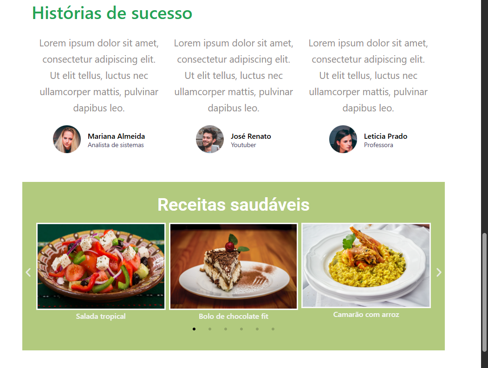
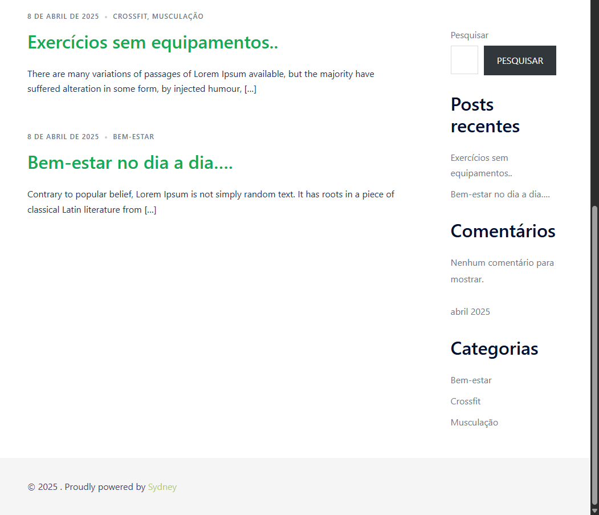

# 10minutos

Curso online:

Domine Web - 20 Cursos - HTML5, CSS3, SASS, Bootstrap, JS, ES6, PHP, MySQL, JQuery, MVC, APIs, IONIC e muito mais

Autores:
Jorge Sant Ana e Jamilton Damasceno

Desenvolvimento de um site utilizando Wordpress com o tema Sydney. 

 
